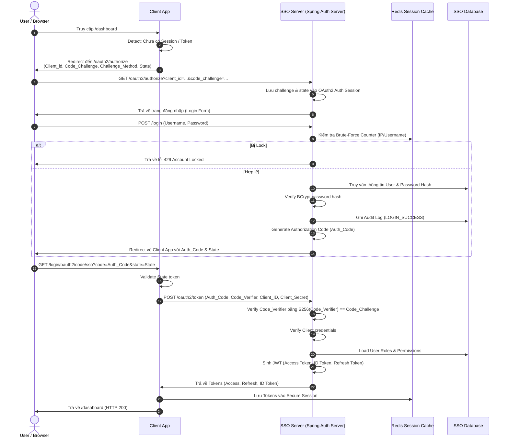
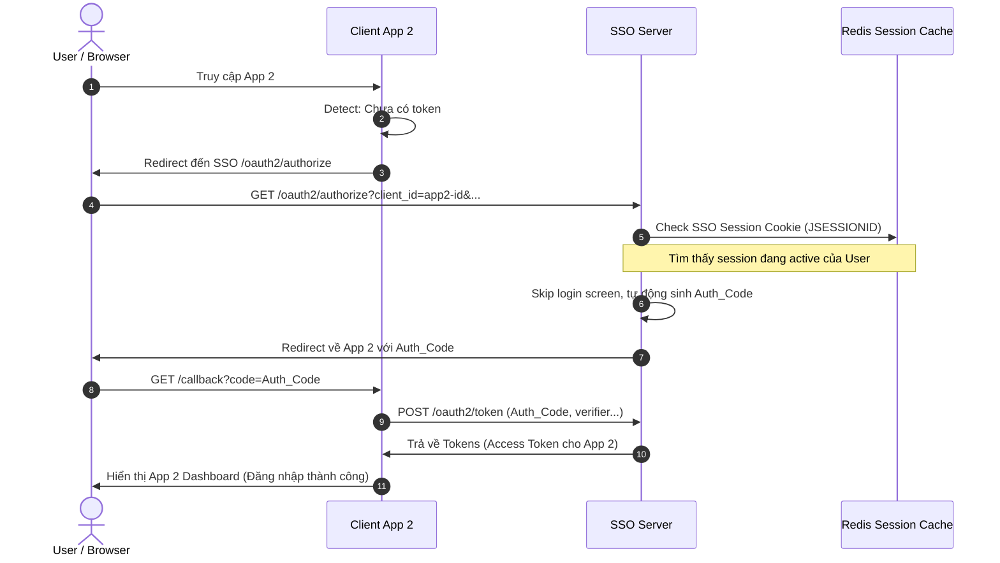
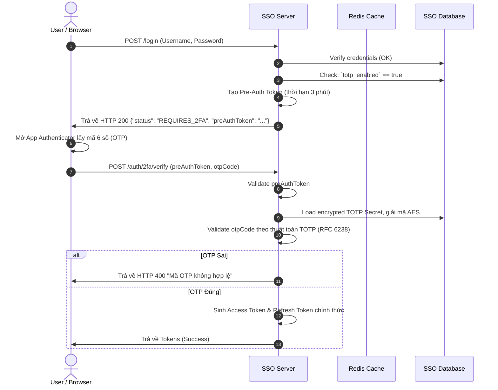
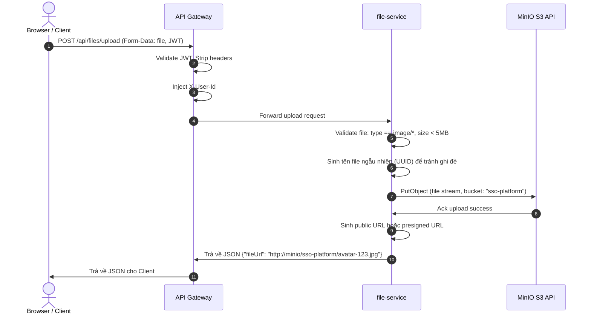
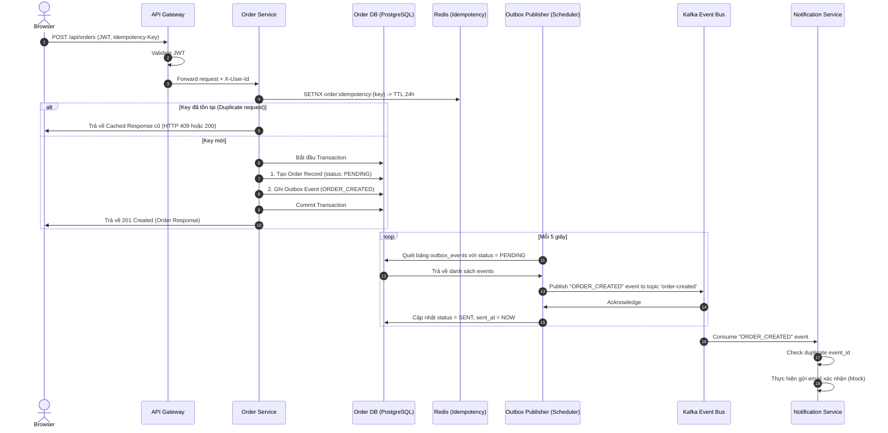
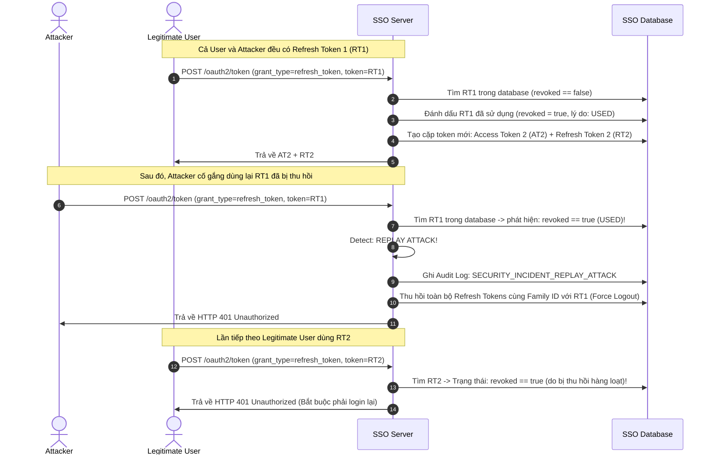
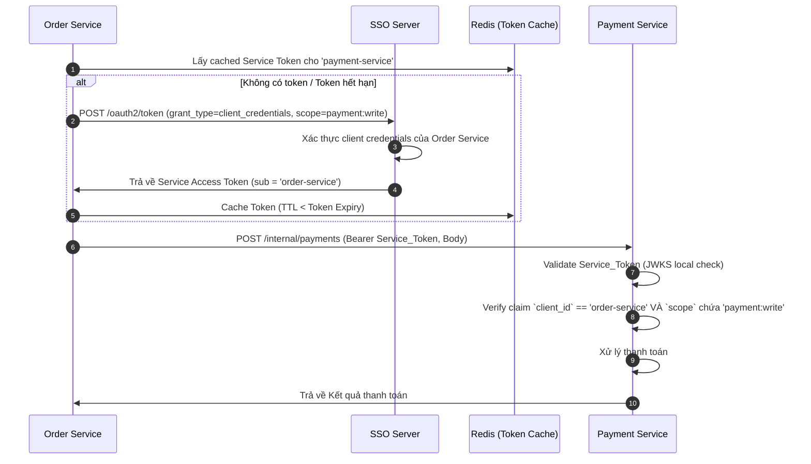

# SSO Platform - Sơ Đồ Tuần Tự (Sequence Diagrams)

Tài liệu này chứa sơ đồ tuần tự chi tiết mô tả các luồng nghiệp vụ và bảo mật cốt lõi trong hệ thống **SSO Platform**.

---

## 1. Luồng Đăng Nhập SSO (OAuth2 Authorization Code + PKCE)

Mô tả cách một Client App (Monolith hoặc Gateway) authenticate người dùng qua SSO Server sử dụng mã kiểm chứng PKCE (`code_challenge` / `code_verifier`).

---

## 2. Luồng SSO Cross-App (Single Sign-On)

Khi đã đăng nhập App 1, truy cập App 2 không cần nhập lại mật khẩu vì Session tại SSO Server vẫn tồn tại.

---

## 3. Luồng Xác Thực Hai Lớp (2FA / TOTP) khi Đăng Nhập

Quy trình đăng nhập nâng cao khi tài khoản đã kích hoạt 2FA.

---

## 4. Centralized File Upload (MinIO + file-service)

Quy trình tải lên hình ảnh sản phẩm / avatar bảo mật thông qua Gateway và file-service lên MinIO Object Storage.

---

## 5. Luồng Tạo Đơn Hàng (Microservice + Outbox + Kafka)

Mô tả quá trình tạo Order đảm bảo tính nhất quán dữ liệu (Eventual Consistency) bằng Transactional Outbox Pattern.

---

## 6. Refresh Token Rotation & Replay Attack Detection

Bảo vệ hệ thống khỏi việc Refresh Token bị đánh cắp và dùng lại.

---

## 7. Service-to-Service Authentication (Client Credentials)

Order Service gọi Payment Service an toàn bằng Token riêng của Service.

