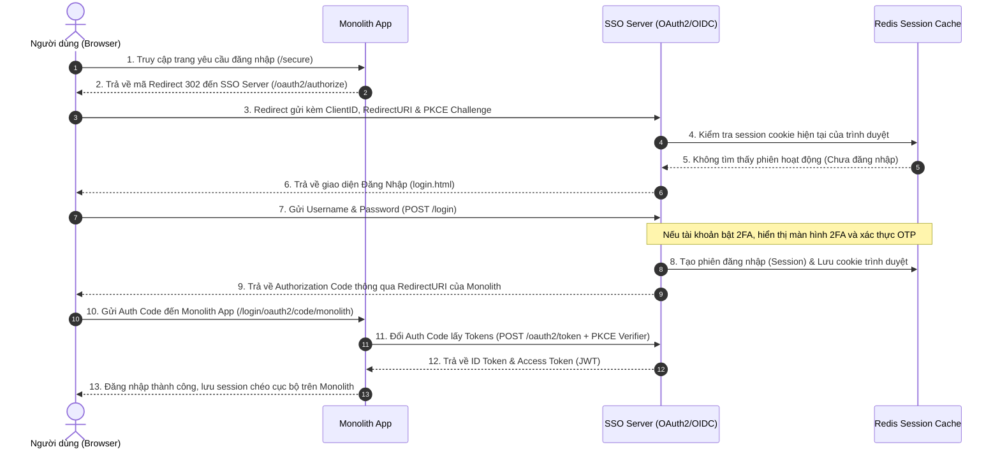
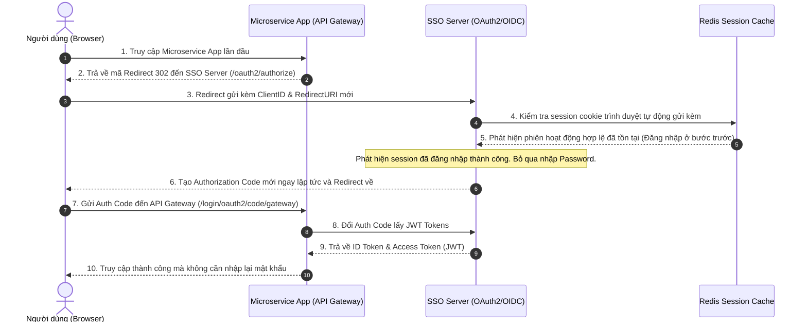
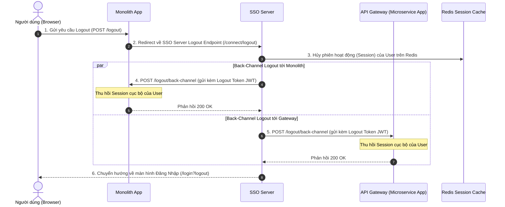

# Biểu Đồ Trình Tự SSO Flow (Sequence Diagram)

Tài liệu này mô tả chi tiết quy trình đăng nhập tập trung (Single Sign-On), kiểm tra phiên hoạt động chéo ứng dụng (Cross-App Session) và đăng xuất đồng bộ (Back-Channel Logout) giữa **SSO Server**, **Monolith App**, và **Microservice App**.

---

## 1. Đăng Nhập Tập Trung (SSO Login Flow)

Khi người dùng truy cập Monolith App lần đầu và chưa đăng nhập:

---

## 2. Kiểm Tra Phiên Hoạt Động Chéo Ứng Dụng (SSO Cross-App Session Flow)

Khi người dùng đã đăng nhập ở Monolith App, nay mở tiếp Microservice App:

---

## 3. Đăng Xuất Đồng Bộ (Back-Channel Logout Flow)

Khi người dùng thực hiện đăng xuất khỏi Monolith App:

